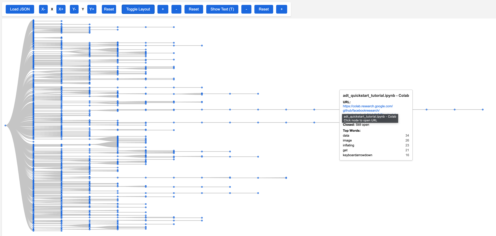

# TabTreeTracker 🌳

A powerful Chrome extension that visualizes your browser tab navigation history as an interactive tree structure. Track, analyze, and visualize how your browsing sessions evolve over time with advanced features for privacy, performance, and usability.



## ✨ Features

### 🌲 Dual Visualization Modes
- **Tree View**: Traditional hierarchical visualization showing parent-child tab relationships
- **Cluster View**: Force-directed layout grouping tabs by domain with intelligent clustering
- **Seamless switching** between visualization modes with smooth transitions
- **Interactive D3.js visualization** with smooth animations and transitions
- **Multiple layout options** (vertical/horizontal for tree view)
- **Advanced zoom controls** with mouse wheel and keyboard shortcuts
- **Node interactions** - click to open URLs, hover for details
- **Responsive design** that works on all screen sizes

### 🎯 Smart Domain Clustering
- **Automatic domain grouping** with intelligent subdomain handling
- **Visual domain boundaries** with customizable cluster strength
- **Force-directed layout** for natural node positioning
- **Domain-based color coding** for easy visual identification
- **Connection mapping** between different domains
- **Enhanced node collection** with domain metadata

### 📊 Smart Tab Tracking
- **Parent-child relationships** between tabs automatically detected
- **Timestamp tracking** for tab creation and closure
- **Content analysis** with user consent (extracts top words from pages)
- **Complete navigation history** with detailed metadata
- **Performance optimized** with data pruning and caching

### 💾 Enhanced Data Management
- **Save/Load functionality** with metadata and versioning
- **Import/Export** with both new and legacy format support
- **Configurable domain exclusions** for privacy
- **Automatic cleanup** of old data to prevent memory issues
- **Session management** with timezone support
- **Data sanitization** removes sensitive URL parameters

### 🔒 Privacy & Security
- **User consent required** for content analysis (opt-in)
- **Local storage only** - no data transmitted to external servers
- **URL sanitization** removes sensitive query parameters
- **Domain exclusion** for sensitive sites
- **Minimal permissions** with clear documentation

### ⚡ Performance Optimizations
- **Debounced storage operations** for better performance
- **Content analysis caching** with automatic cleanup
- **Memory management** with configurable data retention
- **Lazy loading** for improved popup responsiveness
- **Automatic maintenance** with scheduled cleanup tasks

### ♿ Accessibility & UX
- **Full keyboard navigation** with comprehensive shortcuts
- **ARIA labels** and screen reader support
- **Modern, responsive design** with glass morphism effects
- **Interactive tutorial** for first-time users
- **Visual feedback** with animations and loading states
- **High contrast support** for better readability

## 🚀 Installation

### From Source
1. Clone this repository:
   ```bash
   git clone https://github.com/jwt625/TabTreeTracker.git
   ```
2. Open Chrome and navigate to `chrome://extensions/`
3. Enable "Developer mode" in the top right corner
4. Click "Load unpacked" and select the extension directory
5. The extension icon will appear in your toolbar

### First Time Setup
1. Click the extension icon to open the popup
2. Follow the interactive tutorial that appears automatically
3. Configure your preferences in the options page
4. Start tracking by toggling the switch in the popup

## 📖 Usage Guide

### 🎮 Popup Controls
- **Toggle Switch**: Start/stop tab tracking
- **💾 Save Tree**: Export your tree data with metadata
- **📁 Load Tree**: Import previously saved tree data
- **🗑️ Clear Tree**: Remove all current tree data
- **🔍 Open Viewer**: Launch the full tree visualization
- **❓ Help**: Show the interactive tutorial

### 🖥️ Viewer Features
- **Dual View Modes**: Toggle between Tree and Cluster visualizations
- **Mouse Controls**: Wheel to zoom, drag to pan
- **Node Interaction**: Click nodes to open URLs, hover for details
- **Layout Toggle**: Switch between vertical/horizontal (tree view)
- **Cluster Controls**: Adjust clustering strength and domain boundaries
- **Save/Load**: Direct export/import from viewer
- **Keyboard Shortcuts**: Full keyboard navigation support
- **Smooth Transitions**: Animated switching between visualization modes

### 🎯 Cluster View Features
The cluster view provides a revolutionary way to visualize your browsing patterns:

#### Domain-Based Organization
- **Automatic Grouping**: Tabs are automatically grouped by their domain
- **Visual Boundaries**: Optional domain boundaries show cluster regions
- **Color Coding**: Each domain gets a unique color for easy identification
- **Subdomain Handling**: Intelligent grouping of related subdomains

#### Force-Directed Layout
- **Natural Positioning**: Nodes arrange themselves based on relationships
- **Adjustable Clustering**: Control how tightly domains cluster together
- **Dynamic Simulation**: Real-time physics simulation for smooth movement
- **Connection Visualization**: See relationships between different domains

#### Interactive Controls
- **Cluster Strength**: Adjust how tightly nodes cluster by domain
- **Domain Boundaries**: Toggle visual boundaries around domain groups
- **Layout Options**: Fine-tune the force simulation parameters
- **Real-time Updates**: Changes apply immediately with smooth animations

### ⌨️ Keyboard Shortcuts

#### Popup Shortcuts
- `T` - Toggle tracking
- `V` - Open viewer
- `Ctrl+S` - Save tree
- `Ctrl+O` - Load tree
- `Shift+C` - Clear tree

#### Viewer Shortcuts
- `🔄 View Mode` - Toggle between Tree and Cluster views
- `T` - Toggle text display
- `L` - Toggle layout (tree view only)
- `+` / `-` - Zoom in/out
- `0` - Reset zoom
- `Ctrl+S` - Save tree
- `Ctrl+O` - Load tree
- `Esc` - Reset view

## ⚙️ Configuration

### Options Page
Access the options page by right-clicking the extension icon and selecting "Options".

#### Privacy Settings
- **Content Analysis**: Enable/disable page content analysis (disabled by default)
- **Excluded Domains**: Add domains to exclude from tracking

#### Recommended Excluded Domains
```
mendeley.com          # Academic reference manager
google.com            # Search results
chrome://             # Browser internal pages
chrome-extension://   # Extension pages
banking-sites.com     # Financial institutions
```

#### Timezone Configuration
Set your preferred timezone for accurate timestamp display.

## 🔒 Privacy & Security

### Data Storage
- **Local Only**: All data stored locally on your device
- **No Transmission**: No data sent to external servers
- **User Control**: Complete control over what data is collected

### Content Analysis
- **Opt-in Only**: Disabled by default, requires explicit user consent
- **Sanitized URLs**: Sensitive query parameters automatically removed
- **Domain Filtering**: Respects excluded domains list

### Permissions Explained
- `tabs`: Monitor tab creation and navigation
- `storage`: Save preferences and tree data locally
- `activeTab`: Access current tab for content analysis (when enabled)
- `scripting`: Inject content analysis scripts (when enabled)

## 🛠️ Troubleshooting

### Common Issues

**Extension not tracking tabs**
- Ensure tracking is enabled (toggle switch in popup)
- Check if the current domain is in excluded domains list
- Verify extension has necessary permissions

**Tree not displaying**
- Try refreshing the viewer page
- Clear tree data and start fresh
- Check browser console for error messages

**Performance issues**
- Enable automatic data cleanup in options
- Reduce data retention period
- Clear old tree data manually

**Content analysis not working**
- Ensure content analysis is enabled in options
- Check if current site allows content scripts
- Verify site is not in excluded domains

### Getting Help
- Check the interactive tutorial (❓ button in popup)
- Review the permissions documentation
- Report issues on GitHub with detailed steps to reproduce

## 🔧 Technical Details

### Architecture
- **Background Service Worker**: Handles tab tracking and data management
- **Dual Visualization Engine**: Tree and cluster views with seamless switching
- **D3.js Visualization**: Interactive rendering with smooth animations and transitions
- **Domain Clustering System**: Intelligent grouping and force-directed layouts
- **Chrome Storage API**: Local data persistence with automatic cleanup
- **Content Scripts**: Optional page analysis with user consent
- **Modern ES6+**: Clean, maintainable codebase with proper error handling

### Performance Features
- **Debounced Storage**: Batched writes to reduce I/O operations
- **Content Caching**: Analysis results cached for 1 hour
- **Memory Management**: Automatic cleanup of old data
- **Lazy Loading**: Improved popup responsiveness
- **Data Pruning**: Configurable retention periods

### Export Data Structure
```javascript
{
  metadata: {
    version: "1.0",
    exportDate: "2024-01-01T00:00:00.000Z",
    nodeCount: 42,
    extensionVersion: "1.0.0"
  },
  tabTree: {
    "nodeId-timestamp": {
      id: "tabId-timestamp",
      tabId: 123,
      url: "https://example.com",
      title: "Page Title",
      createdAt: 1640995200000,
      closedAt: null,
      children: [],
      topWords: [
        { word: "example", count: 5 },
        { word: "content", count: 3 }
      ]
    }
  },
  exportedBy: "TabTreeTracker"
}
```

### Browser Compatibility
- **Chrome 88+** (Manifest V3 support)
- **Chromium-based browsers** (Edge, Brave, Opera, etc.)
- **Modern JavaScript features** (ES6+, async/await)

### File Structure
```
TabTreeTracker/
├── manifest.json              # Extension manifest (Manifest V3)
├── background.js              # Service worker with tab tracking
├── src/                       # Core utilities and domain clustering
│   ├── constants.js           # Centralized configuration
│   ├── domain-utils.js        # Domain extraction and grouping
│   ├── connection-mapper.js   # Inter-domain connection mapping
│   └── enhanced-node.js       # Enhanced node data structures
├── popup/                     # Modern popup interface
│   ├── popup.html            # Responsive design with tutorial
│   └── popup.js              # Enhanced functionality
├── viewer/                    # Interactive dual-mode viewer
│   ├── viewer.html           # Full-screen visualization
│   ├── viewer.js             # Dual visualization controller
│   └── components/           # Modular visualization components
│       ├── tree.js           # Traditional tree visualization
│       ├── cluster-visualizer.js    # Force-directed cluster view
│       ├── cluster-controls.js      # Cluster-specific controls
│       ├── cluster-boundaries.js    # Domain boundary rendering
│       ├── view-mode-controller.js  # Mode switching logic
│       └── controls.js       # Shared control components
├── options.html              # Configuration page
├── options.js                # Settings management
├── docs/                     # Comprehensive documentation
│   ├── 000-improvement-plan.md
│   ├── 002-domain-clustering-proposal.md
│   └── 003-view-mode-switching-guide.md
├── test/                     # Testing infrastructure
└── README.md                 # This file
```

## 🚀 Development

### Setup
```bash
git clone https://github.com/jwt625/TabTreeTracker.git
cd TabTreeTracker

# Install development dependencies
pnpm install

# Run tests
pnpm test

# Run linting
pnpm lint

# Load unpacked extension in Chrome
```

### Development Tools
- **pnpm**: Fast, efficient package manager
- **ESLint**: Code linting with modern JavaScript standards
- **Prettier**: Code formatting for consistency
- **Vitest**: Fast unit testing framework
- **TypeScript**: Type checking for better code quality

### Code Quality
- **ES6+ JavaScript** with modern async/await patterns
- **Comprehensive error handling** with user-friendly messages
- **Performance optimizations** with debouncing and caching
- **Accessibility features** with ARIA labels and keyboard navigation
- **Modular architecture** with clear separation of concerns
- **Comprehensive testing** with unit and integration tests

## 🤝 Contributing

We welcome contributions! Here's how you can help:

1. **Fork the repository**
2. **Create a feature branch** (`git checkout -b feature/amazing-feature`)
3. **Commit your changes** (`git commit -m 'Add amazing feature'`)
4. **Push to the branch** (`git push origin feature/amazing-feature`)
5. **Open a Pull Request**

## 📄 License

This project is licensed under the MIT License:

```
MIT License

Copyright (c) 2024 [your name]

Permission is hereby granted, free of charge, to any person obtaining a copy
of this software and associated documentation files (the "Software"), to deal
in the Software without restriction, including without limitation the rights
to use, copy, modify, merge, publish, distribute, sublicense, and/or sell
copies of the Software, and to permit persons to whom the Software is
furnished to do so, subject to the following conditions:

The above copyright notice and this permission notice shall be included in all
copies or substantial portions of the Software.

THE SOFTWARE IS PROVIDED "AS IS", WITHOUT WARRANTY OF ANY KIND, EXPRESS OR
IMPLIED, INCLUDING BUT NOT LIMITED TO THE WARRANTIES OF MERCHANTABILITY,
FITNESS FOR A PARTICULAR PURPOSE AND NONINFRINGEMENT. IN NO EVENT SHALL THE
AUTHORS OR COPYRIGHT HOLDERS BE LIABLE FOR ANY CLAIM, DAMAGES OR OTHER
LIABILITY, WHETHER IN AN ACTION OF CONTRACT, TORT OR OTHERWISE, ARISING FROM,
OUT OF OR IN CONNECTION WITH THE SOFTWARE OR THE USE OR OTHER DEALINGS IN THE
SOFTWARE.
```

This extension uses the following open-source libraries:
- [D3.js](https://d3js.org/) - BSD 3-Clause License

